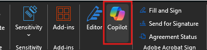

---
demo:
    title: 'Executive Assistant Demo'
---

[Back to Index](https://microsoftlearning.github.io/MS-4021-Copilot-Immersion-Experience/)

# Executive Assistant Demo

**Scenario:**

You’ve been tasked with summarizing the latest earnings conference call transcript for your executive. This task includes extracting key insights, creating an executive summary, and preparing for a follow-up meeting.

## Demo setup

The sample documents can be found in the MS-4021 GitHub repository [here](https://github.com/MicrosoftLearning/MS-4021-Copilot-Immersion-Experience/tree/master/ResourceFiles):

The specific files needed for this demo are:

- [Microsoft_FY24_Second_Quarter_Earnings_Conference_Call_Transcript.docx](https://github.com/MicrosoftLearning/MS-4021-Copilot-Immersion-Experience/raw/master/ResourceFiles/Microsoft_FY24_Second_Quarter_Earnings_Conference_Call_Transcript.docx)

> **NOTE:** Allow up to 10 minutes for these files to sync to your OneDrive after downloading. To avoid delays during the demo, ensure these files are downloaded and available in your OneDrive well in advance. If the files are not available, open the documents and copy the shared file links to use in the demo.

## Demo Steps

### Copilot in Word

We'll start by reviewing the transcript from the most recent earnings call and summarizing the key points for your executive.

1. Select and open the **Microsoft_FY24_Second_Quarter_Earnings_Conference_Call_Transcript.docx** file in Word (either in your browser or desktop application).

    > **NOTE:** You may want to quickly scroll through the document to show how large it is and that it’s not a simple task to summarize it.

1. Select the Copilot icon from the Ribbon:

    

1. The Copilot pane should open. Enter the following prompt where it says **Ask me anything about this document**:

    ```text
    Summarize the key points from the Microsoft FY24 Second Quarter Earnings Conference Call.
    ```

1. Imagine your executive wants to know what Satya Nadella specifically discussed during the call. Use the following prompt:

    ```text
    Provide a brief summary of Satya Nadella's remarks during the earnings call.
    ```

   - Show how Copilot includes references for each bullet point, enabling quick navigation to specific sections.  
   - Click one reference to demonstrate how Copilot instantly brings you to the relevant content in the document.

1. To create a detailed report, ask Copilot:

    ```text
    Analyze the Microsoft FY24 Second Quarter Earnings Conference Call document to provide a comprehensive report that includes:
    - A summary of the key points from each speaker
    - Identification of the top three growth areas and their contributing factors.
    - A detailed breakdown of the financial performance, including revenue, operating income, and earnings per share.
    - Trends in AI adoption and its influence on Microsoft's business strategy.
    - A comparison of this quarter's performance with the same quarter last year, highlighting significant changes.
    - Key strategic initiatives and future outlook as discussed in the call.
    ```

    > **Tip:** Mention that this is a complex prompt and Copilot may take some time to generate the response.

1. Once Copilot completes the analysis, select the **Copy** icon to save the results for the next step.

    


### Copilot Chat

The report provided by Word is a great starting point, but now we want to use Copilot Chat to help us create an executive summary.

1. Open a browser and navigate to [M365copilot.com](https://m365copilot.com/).

1. Ensure **Web mode** is selected.

    

1. Paste the response from Copilot in Word into Copilot Chat with the following prompt:

    ```text
    Based on the following information, provide an executive summary on the following information:

    [paste the Word output here]
    ```

    > **Note:** Clean up any extraneous text from the copied content to ensure clarity.

1. Refine the summary into a concise format:

    ```text
    Summarize this executive summary into a more concise format by focusing on the most critical insights and metrics for each speaker. Use a structured format with headings and bullet points to improve readability. Export to a Word document.
    ```

   - If Copilot doesn’t export the document, rephrase the request: “Save this summary as a Word document.”

1. With the executive summary complete, ask Copilot:

    ```text
    Based on the summarized executive summary, generate 5-7 concise and impactful talking points my manager can use in their next leadership call. Focus on key achievements, growth areas, and strategic priorities.
    ```

### Copilot in Outlook

In this demo, we'll use Copilot in Outlook to set up a meeting with the executive to get them up to speed on everything that happened during the Second Quarter Earnings Conference Call.

1. Open a browser and navigate to [outlook.office.com](https://outlook.office.com.com/).

1. In the Outlook ribbon, select the Copilot Icon to open up the Copilot pane.

1. Use the following prompt to schedule a sync-up:

    ```text
    I need to schedule a 30-minute meeting with [/Pick a colleague] tomorrow afternoon to discuss the Second Quarter Earnings Conference Call. Can you suggest a time that works? If they are unavailable, provide an alternative.
    ```

1. Copilot should suggest a time and date for the meeting. The prompt displays a calendar item that can be sent or edited. Select **Edit**.

1. Switch to scheduling assistant to show that the time suggested by Copilot works for the project manager. You should both be free.

1. Switch back to the event tab and then select **Draft with Copilot** in the event body.

1. In the prompt window, type the following:

    ```text
    I’m meeting with my boss to discuss key updates and strategic initiatives they missed from the Second Quarter Earnings Conference Call. Create an agenda to discuss financial performance, AI and technology integration, strategic acquisitions, productivity updates, and future outlook.
    ```

1. Optionally, before selecting **Keep it**, you can ask Copilot to make it longer, shorter, or change the tone of the drafted agenda.

[Back to Index](https://microsoftlearning.github.io/MS-4021-Copilot-Immersion-Experience/)
