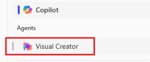

---
demo:
    title: 'Marketing Demo'
---

[Back to Index](https://microsoftlearning.github.io/MS-4021-Copilot-Immersion-Experience/)

# Marketing Demo

**Scenario:**  

You are an Operations Manager at Contoso, responsible for managing vendor procurement and project execution. Your goal is to analyze past Request for Proposals (RFPs), extract key selection criteria, and develop a new RFP for an upcoming initiative.

## Demo Setup

The sample documents can be found in the MS-4021 GitHub repository [here](https://github.com/MicrosoftLearning/MS-4021-Copilot-Immersion-Experience/tree/master/ResourceFiles):

The specific files needed for this demo are:

- [Promotion_Plan_for_Chai_Tea_in_Latin_America.docx](https://github.com/MicrosoftLearning/MS-4021-Copilot-Immersion-Experience/raw/master/ResourceFiles/Promotion_Plan_for_Chai_Tea_in_Latin_America.docx)

- [Mystic_Spice_Premium_Chai_Tea_product_description.docx](https://github.com/MicrosoftLearning/MS-4021-Copilot-Immersion-Experience/raw/master/ResourceFiles/Mystic_Spice_Premium_Chai_Tea_product_description.docx)

- [Contoso_Chai_Tea_market_trends.docx](https://github.com/MicrosoftLearning/MS-4021-Copilot-Immersion-Experience/raw/master/ResourceFiles/Contoso_Chai_Tea_market_trends.docx)

- [Contoso_Chai_Tea_social_marketing_trends.xlsx](https://github.com/MicrosoftLearning/MS-4021-Copilot-Immersion-Experience/raw/master/ResourceFiles/Contoso_Chai_Tea_social_marketing_trends.xlsx)

> **NOTE:** Allow up to 10 minutes for these files to sync to your OneDrive after downloading. To avoid delays during the demo, ensure these files are downloaded and available in your OneDrive well in advance. If the files are not available, open the documents and copy the shared file links to use in the demo.

## Demos

### Copilot in Word

Use Copilot in Word to draft a detailed market analysis report and brainstorm creative marketing campaign ideas tailored to the Latin American market.

1. Open Word (either in your browser or desktop application).

1. In the **describe what you’d like to write** prompt box, type the following:

    ```text
    Create a Market Analysis report for Mystic Spice Premium Chai Tea using the attached files. Include the product description, market trend analysis, and a promotion plan for Latin America.

    [Promotion_Plan_for_Chai_Tea_in_Latin_America.docx], [Mystic_Spice_Premium_Chai_Tea_product_description.docx], [Contoso_Chai_Tea_market_trends.docx]
    ```

    > **NOTE:** Brackets indicate that a document is being referenced. When referencing a document, you can paste the shared link directly or reference the file name if it is available in your OneDrive.

1. Have Copilot create a new section to add social media campaign ideas:

    Input the following prompt:

    ```text
    Draft a new section for social media campaigns to promote Mystic Spice Premium Chai Tea. Include a brief description of 2-3 campaign ideas, each with a unique focus. For each campaign, provide a tagline that reflects its theme and resonates with our target audience of young professionals and tea enthusiasts.
    ```

1. Save this new document as **LATAM_Market_Analysis.docx**.

### Copilot Chat

Use Copilot Chat to evaluate the effectiveness of proposed social media campaigns and refine strategies for cultural relevance in the LATAM market.

1. Open a browser and navigate to [M365copilot.com](https://m365copilot.com/).

1. Ensure Web mode is selected.

    

1. In the prompt window, type the following:

    ```text
    Review the social media campaigns outlined in the Market Analysis Report for Mystic Spice Premium Chai Tea.docx. Evaluate which campaign might resonate best with the LATAM market based on cultural relevance, target audience preferences, and alignment with regional trends. Provide reasons for your choice and suggest any adjustments to improve its impact.
    ```

    > **NOTE:** Do not submit the prompt yet. Move to the next step to upload the file.

1. Select **Add Content** and upload the **LATAM_Market_Analysis.docx** you saved to your OneDrive in the previous demo. Then submit the prompt.

    

1. Copilot should recommend one of the campaigns to focus on and provide suggestions for improvement. In the next prompt, we want Copilot to suggest a marketing campaign slogan for this new idea:

    ```text
    Generate a catchy marketing slogan for the [Campaign name - e.g., 'Morning Motivation'] campaign that highlights its unique value proposition and resonates with the LATAM market. Ensure the slogan reflects a vibrant and culturally relevant tone that appeals to young professionals.
    ```

1. Optionally, for the last prompt, you can ask Copilot to generate a new video for the campaign:

    in Copilot chat, on the right hand side, select the **Visual Creator Agent**:

    

    Then, input the following prompt:

    ```text
    Create a captivating social media video for Mystic Spice Chai Tea that highlights its unique flavor and vibrant appeal. The video should feature eye-catching visuals, with colors, and themes that resonate with young professionals and tea enthusiasts.
    ```

### Copilot in Excel

1. ensure you have downloaded [Contoso_Chai_Tea_market_trends_2023.xlsx](https://github.com/MicrosoftLearning/MS-4021-Copilot-Immersion-Experience/raw/master/Contoso_Chai_Tea_market_trends_2023.xlsx) and open the document in Excel (either on the web or desktop application).

1. Select **Copilot** from the ribbon to open the Copilot pane.

1. Type in the following prompt into Excel:

    ```text
    On average, how many sales do we get per social media campaign view?
    ```

1. Next, ask Copilot to compare sales to social media engagement:

    ```text
    Can you show a correlation between social media engagement and sales?
    ```

1. Next, Type in the following prompt:

    ```text
    How many social media campaign views did we have from September to December?
    ```
