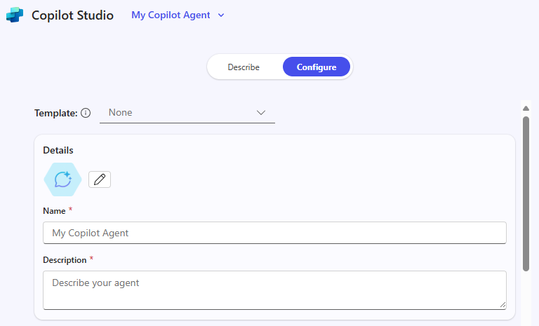
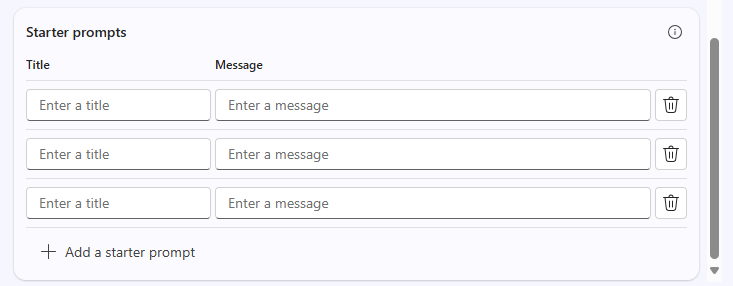

---
demo:
    title: 'Bobcat Exec Onsite Dec 2025'
---

[Back to Index](https://kensingtonschmidt.github.io/CopilotDemos1/)

# Bobcat Onsite - Hands on with M365 Copilot
## Prep Work
> - **Mobile Devices** - Make sure the M365 Copilot app (Note: NOT the Copilot app - that is consumer), Outlook, and Teams apps are installed and that you have signed in at least once.
---
## Reference Material
### Copilot Disambiguation
#### Main User Experiences or App
- **M365 Copilot** - name of the central app, experience, and license that enables the full, rich Copilot experience inside M365. It is accessed via the M365 Copilot app as well as in Word, Excel, PPT, Outlook, OneNote and other M365 apps. You are all licensed users in this training. Note: Some of the people you build agents for may end up not being licensed users.
-  **M365 Copilot Chat** - name of the free/included experience that **all** M365 users can access. Can reason over web data, open documents, and can access agents you deploy.

#### When to use a prompt or build an agent?
- **M365 Copilot** - Microsoft's 'super agent' if you will. It has tremendous and ever expanding capabilities that can be unlocked with good prompting from a chat window in the M365 Copilot app or in the core M365 Apps themselves, such as Word, Excel, PPT, Outlook, OneNote and more.
  - Try prompt first with GCSE best practices
  - Try MS first party agents
  - Individual productivity work that gives me the most flexibility to be creative and research.
- **Copilot Studio Lite** - the built-in agent authoring tool inside of M365 Copilot itself.
  - When I want to 'templatize' my prompts for myself or my team.
  - When I want to narrow the scope to a specific set of data inside M365 or web to create better results
  - When I want to dictate the output to look a certain way or templatize it.
  - When I want to extend an agent with AgentIQ data to unlicensed users
---
## Day in the Life
### Mobile Device
#### M365 Mobile App
> Please make sure you have installed the app titled "M365 Copilot" and not just "Copilot". The latter is the **consumer** app that is a substantially different experience and will not work with your work account.

##### Get an overview of your day
1. Open the M365 Copilot app. If you haven't opened the app before, go through any login or starting screens.
2. Copy the following prompt in the chat and hit send:
   ```text
   Prep me for my day
   ```
3. Review the results

##### Get an overview of your day - Audio
1. Open a new chat by clicking the checkbox in the upper right hand corner.
2. Click on the Speak icon (looks like various size vertical lines where you normally type a prompt)
3. Approve any pop ups that request access to your mic.
4. When the screen says it is listening, say the the following prompt or something similar:
   ```text
   Prep me for my day
   ```
5. Interrupt M365 Copilot from finishing what they are saying to as something specific about a meeting you know was recorded or transcribed in the last week, even if it is a little vague. Ex: "What did Joe tell me to make sure I cover in the Bobcat exec meeting on Tuesday in the meeting last week?"
6. End the voice conversation.

##### Tour the app
1. Click on the menu button in the upper left of the screen to open the full M365 Copilot navigation menu and see you have access to **Chat, Agents, Conversations, Search, Notebooks, Library, and Create**.
2. We will be going through each of these capabilities in more detail on your PC/Mac, but know you have access to the key features even from your mobile device, including your chat history sync'ing across devices.

#### Outlook Mobile - Triage my inbox, Voice catch up, Find quick wins, and more.
1. Open the Outlook app on your mobile device.
2. Click on the Copilot icon in the lower right hand corner.
3. You should see a list of sample prompts and can even scroll to the right to see more.
4. Pick a prompt that looks interesting to you and click on it. You don't have to always type or say a prompt. We have thought of some of the most common and useful for you.
5. View the results, but don't get sucked into work or responding!

#### Teams Mobile - Create Audio recap podcast of meetings
1. Open the Teams app on your mobile device.
2. Navigate to the Calendar screen.
3. Click on the headphones icon in the upper right.
4. Click "New Recap".
5. View and select the style preference for your audio recap.
6. Use the timing pills to find recorded or transcribed meetings from the last X number of days. You can scroll to the right to see more options.
7. Select up to 8 meetings of your choice that you know you need to review.
8. Click the "Generate" button at the bottom of the screen.
9. You have now created an audio podcast for your missed meetings! After it has finished processing, you will be notified and can find the audio recaps under the Headphones icon. These are excellent to listen in to in the car, on a run/walk, at the gym, and many other times!

#### 
### Favorite example prompts for M365 Copilot
#### Chat with GPT-5
> Please make sure GPT-5 is Enabled for the following prompts

##### 1. Priorities Prompt
```text
What are my top priorities today?
```
##### 2. Scheduling prompts
In the same chat window as Prompt 1, click on the three dots below the response and click "Schedule this prompt". 
##### 3. Calendar conflicts prompt  
```text
Analyze my calendar for conflicts this week and recommend how to resolve each conflict
```
##### 4. One on One Meeting prep prompt
```text
Based on prior interactions I’ve had with [/person], give me 5 things that will be top of mind for our next interaction
```
#### Researcher
> Open M365copilot.com in a web browser and run this prompt. Run each subsequent prompt in a new tab in your browser. Currently, we are in the process of updating the desktop app to allow you to navigate away from the prompt and have it still continue processing. For now, we are using a new tab on web for each prompt in order to kick off a series of prompts that take time to run.
##### 1. Research report on my common day to day issues
1. Open a new tab in your web browser and go to M365 Copilot.com.
2. Copy and run the following prompt.
```text
I’m researching common day-to-day issues I face at work, such as processes, collaboration, or time management. Look at recent conversations from Teams chats, Outlook emails, or other collaboration tools related to [your role focus]. Summarize the key issues or pain points mentioned in the last 6 months. Show the results in a table with:  

 - Title: Short label for the issue  
 - Description: Brief summary of the challenge  
 - Frequency: How often it comes up (e.g., number of mentions)
```
3. Researcher will ask you follow up questions to better understand what you want. Answer with whatever feels most useful to you.
   
##### 2. Action item prompt with Researcher
1. Open a new tab in your web browser and go to M365 Copilot.com.
2. Copy and run the following prompt.
```text
Create an action item tracker based on all communication channels and other information you can find from the past 7 days. Split it into two categories - actions pending on me, sorted by urgency (and relevance) and actions that I have asked others to do, categorized by if they have a follow up or not, and how long has it been since my request. Recommend who I need to follow up with or send a reminder to. Draft the follow ups you recommend for me.
```
3. Researcher will ask you follow up questions to better understand what you want. Answer with whatever feels most useful to you.
   
#### Analyst
> Open M365copilot.com in a web browser and use the file Zava Sales Data.xlsx sent to you.

##### 1. Sales insights prompt
**Scenario:** You are a data analyst and get an email from your manager asking you to answer the following 10 questions based on the sales from Zava (fake Microsoft brand). They want the response ASAP. You could do this by hand... or.... you could use your trusty Analyst agent in Copilot.

John/Jane Doe,

I need the answers to the following questions ASAP.

1. What are the top 3 products by total sales, and how do their profit margins compare?
2. Which country generated the highest sales, and what was its average discount rate?
3. How did the sales and profit for the product “Paseo” trend month-over-month in 2024?
4. What is the weighted average selling price (ASP) for each product group, and which group has the highest ASP?
5. Which customer segment achieved the highest average profit per unit sold?
6. What was the best and worst month for total sales, and what were the main drivers?
7. How does the gross margin % for “Paseo” compare to other products in the same segment?
8. What is the share of total sales and units for “Paseo” compared to all products?
9. Which segment had the highest average discount %, and how did that impact their profit?
10. Are there any segments or countries with negative profit or margin, and what’s causing it?
- Your boss

1. Select the Analyst agent from the left navigation pane.
2. Copy the follow prompt. Be sure to replace the information in brackets with the "/" command to search for the file Zava Sales Data.xlsx that has been saved to a SharePoint site in the Bobcat environment for use for this demo.
``` text
I need help answering the following 10 sales insights questions. Create a 2-column table with the question & response, and use [/Zava Sales Data.xlsx]. Here are the questions: 1. What are the top 3 products by total sales, and how do their profit margins compare? 2. Which country generated the highest sales, and what was its average discount rate? 3. How did the sales and profit for the product “Paseo” trend month-over-month in 2024? 4. What is the weighted average selling price (ASP) for each product group, and which group has the highest ASP? 5. Which customer segment achieved the highest average profit per unit sold? 6. What was the best and worst month for total sales, and what were the main drivers? 7. How does the gross margin % for “Paseo” compare to other products in the same segment? 8. What is the share of total sales and units for “Paseo” compared to all products? 9. Which segment had the highest average discount %, and how did that impact their profit? 10. Are there any segments or countries with negative profit or margin, and what’s causing it?
```
##### 2. Check your answers
One the prompt is finished, Feel free to reference the second excel spreadsheet called [Zava Sales data validation.xslx] to check your answers. How long would it have taken you to do this manually?

---
##### Notebooks
> Use all of the Zava Sales Org QBR Word files sent to you

1. Create a new notebook called "Quarterly Business Reports" and add the 6 files by finding them in your OneDrive folder you created earlier.
2. Use the following prompt:
```text
Create a chart showing our revenue growth and profit margins from FY24Q2 to FY25Q2 and include a list of the top 5 business outcomes for an annual report.    
```
3. Go back to the main page for the Quarterly Business Review notebook.
4. Select "Get audio overview" and then click Generate audio.
5. Select your style preferences. Add any specific instructions you would like.

---
## Copilot in the flow of work with the M365 Apps
> Your researcher prompts should now be completed. Go take a look.

**Scenario:** You need to research something with a colleague and submit a report.
1. Open the results of the first researcher prompt with the research report on the topic you chose.
2. Click edit in pages.
3. You want help from a colleague on a portion of this. @mention someone sitting next to you. Make sure you click on their name to allow access.
4. Open the pages in Word.
5. Check out the automatic Summary at the top from Copilot along with the Insights.
6. Save the word document as "Research Report on [Your Topic]" to your OneDrive.

>The following scenario and instructions assume you are using New Outlook and not Outlook (classic).
   
**Scenario:** You need to reply to a lengthy email chain and schedule a follow up meeting to spare everyone's inboxes.
1. Open Outlook.
2. Find a lengthy email chain from your actual inbox and click on "Summary by Copilot" to ask it to summarize.
3. Click 'Reply' to reply to the email chain.
4. Click the fancy pencil icon to Draft with Copilot. Proceed to “word vomit” your reply and let Copilot make you sound good.
5. Send the email if you want to do so.
6. Find that same lengthy email chain and click the "Schedule with Copilot" button in New Outlook.
7. View and insert the Copilot generated summary and agenda.
8. Send the meeting invite.

## Immersion Experience – Agents (Executives)

Explore how Microsoft 365 Copilot and Copilot Studio can help you address a real work-related challenge by designing a simple **retrieval-based agent**. This exercise will walk you through identifying an issue, breaking it down, exploring where AI might help, and then creating a conceptual agent to solve it.  

You'll perform four tasks:

- Identify a work-related issue  
- Break down the problem and explore where AI could help  
- Use **Researcher** to uncover insights and solution ideas  
- Conceptualize and mock up a retrieval-based agent in **Copilot Studio**  

> **NOTE:** Sample prompts are provided to help you get started—feel free to personalize them to fit your situation. 
>
> If you’d like help generating or refining prompts, try the <a href="https://appsource.microsoft.com/en-us/product/office/WA200007578" target="_blank">Prompt Coach agent</a><br>, which can suggest, improve, and evaluate prompts so you get better results with Copilot.

### Task 1: Identify a Work-Related Challenge  

Start by thinking about a real issue you encounter in your role—something that slows you down or makes information harder to access. You can reflect individually, or use **Copilot Chat** as a partner to help generate ideas and identify a challenge where retrieving and organizing knowledge would make a difference.  

To guide your thinking, consider:  

- **What’s working well today**  
- **What’s not working well**  
- **Where AI *might* be able to help**  

**Steps:**  

- Open a new browser tab and navigate to [m365.cloud.microsoft/chat](https://m365.cloud.microsoft/chat).  
- Ensure the **Work mode** tab is selected in **Copilot Chat**:  

     

    **Sample Prompt:**

   ```text
   I’m researching common day-to-day issues I face at work, such as processes, collaboration, or time management. Look at recent conversations from [Teams chats, Outlook emails, or other collaboration tools] related to [your role focus]. Summarize the key issues or pain points mentioned in the last 6 months. Show the results in a table with:  

    - Title: Short label for the issue  
    - Description: Brief summary of the challenge  
    - Frequency: How often it comes up (e.g., number of mentions)
   ```

### Task 2: Break Down the Problem

Using **Copilot Chat**, take the challenge you identified in Task 1 and break it into smaller parts:

- What makes this issue difficult?  
- Where does information get stuck or lost?  
- Who is impacted most?  

    **Sample Prompt (Copilot Chat – Work Mode):**

    ```text
    Break down the problem of [insert challenge]. Identify root causes, pain points, and which areas of work are most affected.
    ```

    > **TIP:** Think about where retrieval of knowledge would save you time or help your team make faster decisions.

### Task 3: Explore AI Solution Ideas with Researcher

Use the **Researcher Agent** to see how Copilot and agents could help. Focus on solutions that retrieve, organize, or summarize knowledge—not automate tasks. 

**Steps:**

- Open a new browser tab and navigate to [m365.cloud.microsoft/chat](https://m365.cloud.microsoft/chat).
- In the Copilot Chat menu, expand **Agents** and select **Researcher**  

      

    **Sample Prompt (Researcher Agent):**

    ```text
    Explore possible AI solutions to address [insert problem]. Focus on retrieval-based approaches using Microsoft Copilot, Copilot Studio agents, or connected knowledge sources. Summarize three possible solution approaches, their benefits, and limitations.
    ```

    > **TIP:** Look for opportunities where an agent could make knowledge easier to find, reuse, or share.

    > **NOTE:** Researcher may take 5–10 minutes to complete, depending on your request. Its responses are highly detailed, so while it’s working, try running the same prompt in Copilot Chat. Comparing the two outputs is a great way to see how each tool approaches the task.

### Task 4: Conceptualize Your Agent

Now, take your insights and create a simple mock agent in **Copilot Studio**. Keep the focus on retrieval—your agent should help surface, organize, or summarize information.

**Steps:**

- **Start in Copilot Studio**

    1. Open your browser and navigate to [m365.cloud.microsoft/chat](https://m365.cloud.microsoft/chat).
    1. Select **Create agent** in the right-hand rail to launch **Copilot Studio**.

        

- **Define your Agent (Describe tab or Configure tab)**

    1. Choose the **Describe** tab and use this sample prompt (or write your own):

        ```text
        You’re a virtual assistant for our [project/team name]. Your role is to help with [key tasks]. Be concise, stay on-brand, and reference our shared resources when possible.
        ```

        

        > **NOTE:** You can start from scratch or base your agent on a template, which pre-populates settings and instructions you can later customize.

    1. If **Describe** isn’t available, switch to the **Configure** tab and enter the same details manually: name, description, and agent instructions.

        

- **Customize your Agent**

    In the **Configure** tab, explore these options:

    1. Add at least one knowledge source (e.g., a document saved to OneDrive/SharePoint or Your emails).

        

    1. Define starter prompts to help others get started with your agent

        

        > **TIP:** Starter prompts help guide users on how to interact with your agent.

- **Test and Create**

    1. Use the **Test** feature (available in the right pane throughout the agent-building process) to try out your draft agent and refine any issues.
    2. Once satisfied, select **Create** to publish the agent.
    3. Share your agent with others or open it for immediate use.  

> **TIP:** The goal isn’t to build a perfect agent today—it’s to explore how retrieval-focused agents can make knowledge easier to access in your daily work.

---

