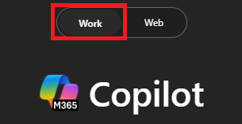
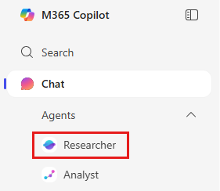

---
demo:
    title: 'Niagara Onsite Nov 2025'
---

[Back to Index](https://kensingtonschmidt.github.io/CopilotDemos1/)

# Niagara Onsite Nov 2025
## Search
Find the file you someone sent you last week that you don’t remember what it is called or where it is saved.

---
## Prompting
### GCSE in Action
#### Prompt 1
```text
Write a job description for a senior project manager
```
#### Prompt 2
```text
Generate a comprehensive job description for a senior project manager focused on technical project management for consumer electronic hardware. This role is urgent, and the candidate will join a dynamic team. Reference our company’s standard specs and industry norms. The description should be concise, max two pages, including responsibilities, qualifications.
```
### Extending the Prompt's Purpose
#### Prompt 1
> Anytime we use [] , please replace the object with something relevant from your environment and your work life.

```text
Recap the [/Contoso and Fabrikam Sustainability] meeting creating a table for action items, owners and due dates.
```
#### Prompt 2
```text
Write a follow up e-mail to the attendees of the /Contoso and Fabrikam Sustainability meeting with a table showing decisions made, another showing actions and owners and lastly a list of considerations for the next meeting
```
### Favorite example prompts for M365 Copilot
#### Chat with GPT-5
> Please make sure GPT-5 is Enabled for the following prompts

##### Prompt 1
```text
What are my top priorities today?
```
##### Prompt 2
```text
Analyze my calendar for conflicts and recommend how to resolve each conflict
```
##### Prompt 3
```text
Based on prior interactions I’ve had with [/person], give me 5 things that will be top of mind for our next interaction
```
##### Prompt 4
```text
Identify all tasks or action items assigned to me from my manager in this week’s emails, Teams chats, and meeting notes, and compile them into a checklist with due dates.
```
##### Prompt 5
```text
Help me identify colleagues with expertise in [topic]. Summarize their current role, key skills, and how their experience aligns with this topic.
```
##### Prompt 6
```text
Create a 360-degree overview of [customer] for an upcoming meeting based on recent emails, meetings, and status report, along with recent company news. Share recommendations for the meeting and potential questions I should ask. 
```
#### Researcher
> Open M365copilot.com in a web browser and run this prompt. Run each subsequent prompt in a new tab in your browser.

##### Prompt 1
```text
Based on the internal meeting discussion on [topic], draft a comprehensive research report evaluating the ideas proposed. Incorporate relevant insights from external market research, customer meetings and internal intelligence.
```
##### Prompt 2
```text
Create an action item tracker based on all communication channels and other information you can find from the past 7 days. Split it into two categories - actions pending on me, sorted by urgency (and relevance) and actions that I have asked others to do, categorized by if they have a follow up or not, and how long has it been since my request. Recommend who I need to follow up with or send a reminder to. 
```
#### Analyst
> Open M365copilot.com in a web browser and use the file Zava Sales Data.xlsx sent to you.
  
``` text
I need help answering the following 10 sales insights questions. Create a 2-column table with the question & response, and use [/Zava Sales Data.xlsx]. Here are the questions: 1. What are the top 3 products by total sales, and how do their profit margins compare? 2. Which country generated the highest sales, and what was its average discount rate? 3. How did the sales and profit for the product “Paseo” trend month-over-month in 2024? 4. What is the weighted average selling price (ASP) for each product group, and which group has the highest ASP? 5. Which customer segment achieved the highest average profit per unit sold? 6. What was the best and worst month for total sales, and what were the main drivers? 7. How does the gross margin % for “Paseo” compare to other products in the same segment? 8. What is the share of total sales and units for “Paseo” compared to all products? 9. Which segment had the highest average discount %, and how did that impact their profit? 10. Are there any segments or countries with negative profit or margin, and what’s causing it?
```
Feel free to reference the second excel spreadsheet called Zava Sales data validation.xslx to check your answers. How long would it have taken you to do this manually?

---
## Notebooks
> Use all of the Zava Sales Org QBR Word files sent to you

1. Create a new notebook called "Quarterly Business Reports" and add the 6 files.
2. Use the following prompt:
```text
Create a chart showing our revenue growth and profit margins from FY24Q2 to FY25Q2 and include a list of the top 5 business outcomes for an annual report.    
```
3. Go back to the main page for the Quarterly Business Review notebook.
4. Select "Get audio overview" and then click Generate audio.
5. Select your style preferences. Add any specific instructions you would like.

---
## Create
> Open M365copilot.com in a web browser and use the file Zava Sales Data.xlsx sent to you.
  
1. Click on Infographic.
2. Notice your options around orientation and brand kits. Use the following prompt:
   ```text
   Create an infographic showing the most popular flavors of water
   ```
3. Edit the suggested text as desired. Run the creation process and view the result.

---
## Copilot in the flow of work with the M365 Apps
Your researcher prompts should now be completed. Go take a look.
1. Open the results of the first researcher prompt with the research report on the topic you chose.
2. Click edit in pages.
3. You want help from a colleague on a portion of this. @mention someone sitting next to you. Make sure you click on their name to allow access.
4. Open the pages in Word.
5. Save the word document as "Research Report on [Your Topic]" to your OneDrive.
6. Open Powerpoint and select "Create a presentation with Copilot"
7. Use the following prompt:
 ```text
Create an executive summary presentation for the board on the research from [/Research Report on [Your topic]].
```
8. Select the 'Creative' style.
9. View the length options and select your preference.
10. Run the prompt and view the results.
11. Translate the presentation into the language of your choice.
12. Open Outlook.
13. Find a lengthy email chain and ask it to summarize.
14. Reply to the email thread using Copilot to help you draft by using "word vomit".

---
## Copilot Studio Lite
Discover how Microsoft 365 Copilot and Copilot Studio Lite can help you solve everyday productivity challenges by designing a simple **retrieval-based agent**. This streamlined exercise will walk you through identifying a common issue, exploring how AI could help, and then creating a simple agent to test.  

You'll perform three tasks:

- Identify a productivity pain point  
- Explore how AI could help with retrieval and organization  
- Build and test a simple agent in **Copilot Studio Lite**  

> **NOTE:** Sample prompts are provided to help you get started—feel free to personalize them to fit your situation.  
>
> If you’d like help generating or refining prompts, try the <a href="https://appsource.microsoft.com/en-us/product/office/WA200007578" target="_blank">Prompt Coach agent</a>, which can suggest, improve, and evaluate prompts so you get better results with Copilot.

### Task 1: Identify a Productivity Challenge  

Think about a common issue in your day-to-day work—something that slows you down or makes it harder to find or organize information. You can reflect individually, or use **Copilot Chat** as a partner to help generate ideas and surface common pain points.

Examples:

- Finding the latest version of a document  
- Gathering updates from multiple emails or chats  
- Remembering details from past projects or meetings  

**Steps:**  

- Open a new browser tab and navigate to [m365.cloud.microsoft/chat](https://m365.cloud.microsoft/chat). 

- Ensure the **Work mode** tab is selected in **Copilot Chat**.  

     

    **Sample Prompt:**

    ```text
    Summarize the top challenges I face in my daily work, based on recent emails, chats, and documents. Show results in a simple list with: 
    
    - Title (short label for the issue) 
    - Description (1–2 sentences) 
    ```  

### Task 2: Explore AI Solution Ideas with Researcher  

Use the **Researcher Agent** to explore how Copilot or agents might help with your chosen challenge.

**Steps:**  

- In the Copilot Chat menu, expand **Agents** and select **Researcher**.  

     

- Try a sample prompt like this:  

   ```text
   Explore possible AI solutions to help with [insert productivity issue]. Focus on retrieval-based approaches using Microsoft Copilot or Copilot Studio agents. Summarize two or three ways an agent could help me find, organize, or summarize information more efficiently.
   ```  

    > **TIP:** Keep the focus on practical, everyday use cases—like quickly surfacing a doc or pulling updates from multiple sources.
  
    > **NOTE:** Researcher may take 5–10 minutes to complete, depending on your request. Its responses are highly detailed, so while it’s working, try running the same prompt in Copilot Chat. Comparing the two outputs is a great way to see how each tool approaches the task.
    
### Task 3: Build and Test Your Agent  

Now, create a simple retrieval agent in **Copilot Studio** to address your challenge.  

**Steps:**  

1. In the **Copilot Chat** menu, select **Create agent**.

     

1. In the **Describe** tab, draft your agent’s role. For example:  

   ```text
   You’re a virtual assistant that helps me with [key task]. Be concise and always reference my recent files or resources when possible.
   ```  

     

1. Select the **Configure** Tab and add one knowledge source (e.g., **My Emails** or **My Teams chats and meetings**).

    

1. Test your agent using the **Test** pane and refine as needed.  
1. Select **Create** to publish your agent and start using it.  

> **TIP:** Even a very simple agent—like one that helps you find recent project files—can show the power of retrieval in your daily work.


---
[Back to Index](https://kensingtonschmidt.github.io/CopilotDemos1/)
