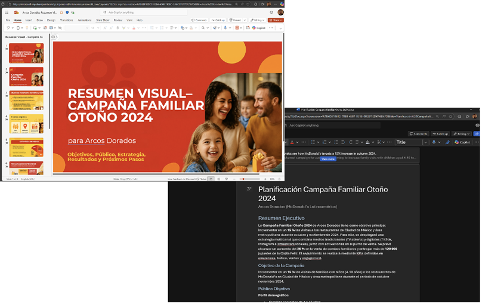
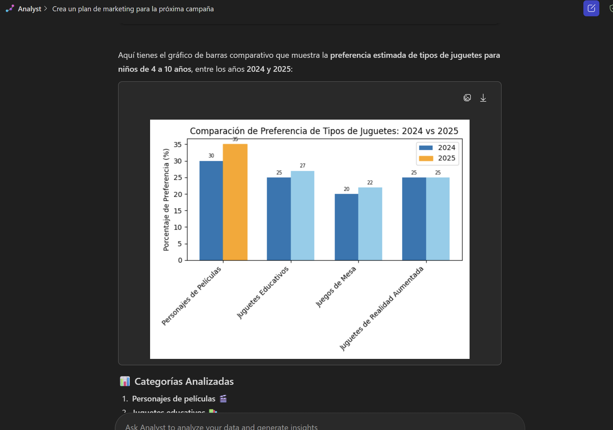

---
demo:
    title: 'Researcher and Analyst Demo'
---

[Back to Index](https://github.com/emontes07/Learning/)

# Agente Researcher

Esta demostración destaca cómo usar el agente **Researcher**, este es un agente experto integrados en la aplicación Copilot. Researcher te ayuda a abordar tareas de investigación de múltiples pasos, combinando datos web con archivos y conocimientos de tu empresa.

- **Researcher** te ayuda a abordar tareas de investigación de múltiples pasos, combinando datos web con los archivos y el conocimiento de tu empresa.
  
**Tarea 1: Realizar investigación y análisis en línea**

Para completar estas demostraciones, deberás descargar lo siguientes archivos que contiene todos los archivos y recursos necesarios.

- [Arcos Dorados Resumen Visual Campaña 2024](https://github.com/emontes07/Learning/blob/main/ResourceFiles/Arcos%20Dorados%20Resumen%20Visual%20%E2%80%93%20Campa%C3%B1a%20Familiar%202024.pptx)

- [Arcos Dorados - Planificación Campaña Familiar 2024](https://github.com/emontes07/Learning/blob/main/ResourceFiles/Arcos%20Dorados%20-%20Planificaci%C3%B3n%20Campa%C3%B1a%20Familiar%202024.docx)

  

> **💡 Tip: :** Antes de realizar la demostración, puedes almacenar los archivos en un sitio de SharePoint de tu entorno de pruebas para facilitar el acceso. Alternativamente, puedes guardar los archivos localmente y hacer referencia a ellos directamente en tus indicaciones usando **/**.


Para acceder a estos agentes:  

- Abre la **aplicación Copilot** desde [m365.cloud.microsoft](https://m365.cloud.microsoft).  
- Usa la **navegación del panel izquierdo** para seleccionar  **Reasercher**.  

> **Nota:** Deberás vincular Researcher y Analyst a archivos internos (SharePoint/OneDrive) para obtener información fundamentada en datos confiables.

---

## Escenario
• El departamento de Marketing de Arcos Dorados está planificando la campaña de octubre 2025 en Ciudad de México.
• Para esta planeación, utilizarán el agente **Researcher** en Copilot.
• El agente ayudará a:
  – Investigar tendencias y comportamientos de consumo.
  – Proponer alianzas estratégicas para la Cajita Feliz.
  – Recomendar el tipo de juguetes más relevantes para la audiencia infantil.
• ¿Por qué usar Researcher?
  – Analiza datos de mercado de forma rápida y confiable.
  – Detecta oportunidades y brechas en la estrategia actual.
  – Visualiza el impacto estimado de cada recomendación.
  – Reduce riesgos al evitar decisiones basadas solo en intuición.

---

### Researcher: Construye un Plan de Marketing


1. Abre **Researcher** desde la navegación izquierda en la aplicación de Copilot.  

      

2. Ingresa el siguiente prompt:

    ```text
    Crea un plan de marketing para la próxima campaña de Cajita Feliz 
    durante el evento en Ciudad de México (24-26 octubre 2025). 
    Destaca posibles alianzas con franquicias infantiles, 
    recomienda el tipo de juguetes más atractivos para niños de 4 a 10 años 
    y sugiere la mezcla de canales más efectiva (TV, redes sociales, activaciones en restaurante). 
    Incluye aprendizajes de campañas pasadas y referencias de competidores como Burger King y KFC.
    ```

1. Adjunta los archivos de referencia usando `/` (apuntando a SharePoint/OneDrive):  

- [Arcos Dorados Resumen Visual Campaña 2024](https://github.com/emontes07/Learning/blob/main/ResourceFiles/Arcos%20Dorados%20Resumen%20Visual%20%E2%80%93%20Campa%C3%B1a%20Familiar%202024.pptx)

- [Arcos Dorados - Planificación Campaña Familiar 2024](https://github.com/emontes07/Learning/blob/main/ResourceFiles/Arcos%20Dorados%20-%20Planificaci%C3%B3n%20Campa%C3%B1a%20Familiar%202024.docx)


      

2. Haz clic en **Enviar**.  

Researcher hará lo siguiente:  

- Combinará los hallazgos de los documentos internos con información del mercado y la web.  
- Estructurará un plan de marketing con recomendaciones sobre la mezcla de canales y la estrategia de contenidos.  
- Citará las fuentes para que puedas validar el análisis.  

> **Nota:** Researcher muestra su ruta de razonamiento (“chain of thought”) y puede invocar otros agentes si es necesario.  

### Researcher: Segmentación de Clientes y Modelado Financiero

1. Abre **Researcher** desde la navegación izquierda en la aplicación de Copilot. 

   


1. Ingresa el siguiente prompt:

    ```text
    Genera un gráfico de barras que muestre la preferencia de tipo de juguetes 
    para niños de 4 a 10 años, comparando 2024 vs. 2025. 
    Clasifica por categoría (por ejemplo: personajes de películas, juguetes educativos, 
    juegos de mesa, juguetes de realidad aumentada). 
    Incluye el porcentaje estimado de preferencia para cada categoría y 
    destaca en color la categoría con mayor crecimiento esperado.
    ```

1. Click **Submit**. 

Researcher hará lo siguiente:  

- Analizará el conjunto de datos.  
- Identificará los segmentos de clientes de mayor valor.  
- Proporcionará visualizaciones que respalden las recomendaciones.

  

### Preguntas de Seguimiento para el Researcher Agent

Después de recibir el primer análisis, puedes hacer estas dos preguntas para profundizar en el escenario:

**Pregunta 1:**  

```text
Realiza un análisis de correlación entre el tipo de juguete ofrecido en la Cajita Feliz 
y el incremento en visitas al restaurante (medido en %). 
Identifica qué categorías tienen mayor correlación positiva con el tráfico de clientes 
y sugiere cuáles priorizar en la próxima campaña.
```

**Pregunta 2:**  

```text
Propón una estrategia de comunicación digital que complemente la campaña,  
incluyendo ejemplos de publicaciones en TikTok, dinámicas en Instagram y activaciones en restaurantes.
```


### Escenarios adicionales para Researcher

Puedes ejecutar estos mensajes adicionales para variar. Cada uno sigue el mismo patrón: **Mensaje → Adjuntar archivo → Enviar → Revisar resultados.**

- **Proyección financiera**  

    ```text
    Construye una proyección financiera a 5 años a partir de estos datos junto con un gráfico para visualizar el crecimiento de ingresos en el tiempo.
    ```  


- **Rendimiento de ventas**  

    ```text
    Analiza el volumen de ventas por ubicación para identificar nuestras tiendas con mejor y peor rendimiento, 
    junto con una visualización de los productos más vendidos.
    ```  


- **Rendimiento de campaña**  

    ```text
    Analiza y visualiza cómo se desempeñó la campaña de marketing en cada segmento objetivo 
    y ayúdame a decidir dónde reorientar nuestra próxima campaña.
    ```  


## Conclusión clave

- **Researcher**: acelera la estrategia y planificación con investigaciones de alta calidad.  
- **Analyst**: ofrece información basada en datos con análisis avanzados y visualizaciones.  

Juntos, Researcher y Analyst acortan el camino de la **pregunta al conocimiento**, convirtiendo semanas de trabajo en minutos.

[Back to Index](https://emontes07.github.io/Learning/)

