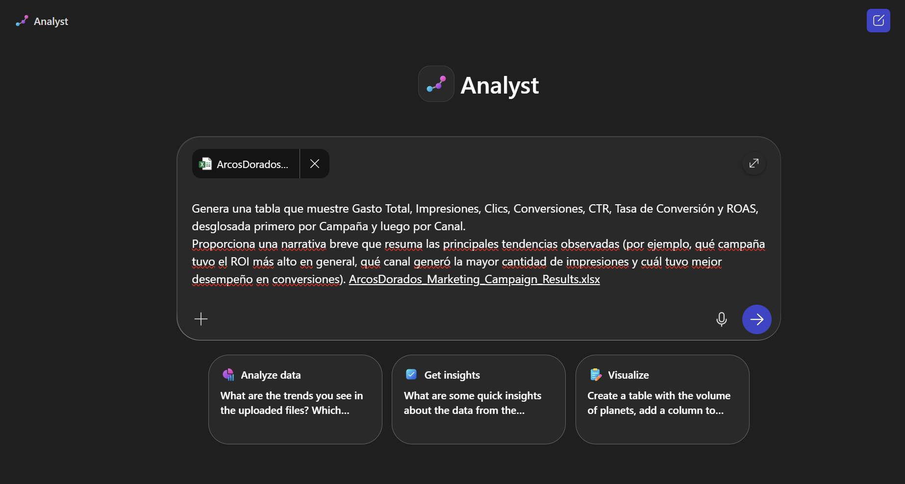

---
demo:
    title: 'Researcher and Analyst Demo'
---

[Back to Index](https://emontes07.github.io/Learning/)

# Agente Analyst

Esta demostración destaca cómo usar el agente **Analyst**, piensa como un científico de datos experto, capaz de realizar análisis avanzados de datos y ejecutar Python, incluso si no sabes programar.


**Tarea 1: Realizar análisis de resultados de campañas de Marketing**

Para completar estas demostraciones, deberás descargar lo siguientes archivos que contiene todos los archivos y recursos necesarios.

- [Arcos Dorados Datos Campaña Marketing](https://github.com/emontes07/Learning/blob/main/ResourceFiles/ArcosDorados_Marketing_Campaign_Results.xlsx)


> **💡 Tip: :** Antes de realizar la demostración, puedes almacenar los archivos en un sitio de SharePoint de tu entorno de pruebas para facilitar el acceso. Alternativamente, puedes guardar los archivos localmente y hacer referencia a ellos directamente en tus indicaciones usando **/**.


Para acceder a estos agentes:  

- Abre la **aplicación Copilot** desde [m365.cloud.microsoft](https://m365.cloud.microsoft).  
- Usa la **navegación del panel izquierdo** para seleccionar  **Analyst**.  

> **Nota:** Deberás vincular Analyst y Analyst a archivos internos (SharePoint/OneDrive) para obtener información fundamentada en datos confiables.

---

## Escenario
- El departamento de Marketing de Arcos Dorados está planificando la Campaña Familiar de octubre 2025 en Ciudad de México, aprovechando datos históricos de campañas como Cajita Feliz: Aventuras CDMX, McFlurry Edición Pan de Muerto y Monopoly McDonald’s 2025.

- Para esta planeación utilizarán el agente Analyst en Copilot junto con el nuevo archivo de resultados de campañas de marketing que incluye datos por canal, ROI y desempeño de promociones.

El agente ayudará a:
- Investigar tendencias y comportamientos de consumo en familias urbanas y su afinidad con licencias de entretenimiento.
- Proponer alianzas estratégicas para la Cajita Feliz (p. ej., películas de estreno o colecciones coleccionables).
- Recomendar el tipo de juguetes más relevantes para la audiencia infantil de 4–10 años.

¿Por qué usar Analyst?
- Analiza datos de mercado y de campañas pasadas de forma rápida y confiable.
- Detecta oportunidades y brechas en la estrategia actual (por ejemplo, baja inversión en canales digitales o poca activación en eventos locales).
- Visualiza el impacto estimado de cada recomendación en KPIs como ventas, tráfico a restaurantes y awareness.
- Reduce riesgos al evitar decisiones basadas solo en intuición y ayuda a optimizar presupuesto por canal.

---

### Analyst: Construye un Plan de Marketing


1. Abre **Analyst** desde la navegación izquierda en la aplicación de Copilot.  

      

2. Ingresa el siguiente prompt:

    ```text
    Genera una tabla que muestre Gasto Total, Impresiones, Clics, Conversiones, CTR, Tasa de Conversión y ROAS, desglosada primero por Campaña y luego por Canal.
    Proporciona una narrativa breve que resuma las principales tendencias observadas (por ejemplo, qué campaña tuvo el ROI más alto en general, qué canal generó la mayor cantidad de impresiones y cuál tuvo mejor desempeño en conversiones).
    ```

1. Adjunta los archivos de referencia usando `/` (apuntando a SharePoint/OneDrive):  

- [Arcos Dorados Datos Campaña Marketing](https://github.com/emontes07/Learning/blob/main/ResourceFiles/ArcosDorados_Marketing_Campaign_Results.xlsx)

      

2. Haz clic en **Enviar**.  

Analyst hará lo siguiente:  

- Analizará los datos de los archivos internos para identificar patrones, segmentos clave y oportunidades.  
- Generará modelos y visualizaciones que respalden decisiones estratégicas, como segmentación de clientes o proyecciones financieras.  
- Explicará su razonamiento de forma clara y transparente, permitiendo validar cada paso del análisis.

> **Nota:** Analyst muestra su ruta de razonamiento (“chain of thought”) y puede invocar otros agentes si es necesario.  

### Analyst: Segmentación de Clientes y Modelado Financiero

1. Abre **Analyst** desde la navegación izquierda en la aplicación de Copilot. 

   


1. Ingresa el siguiente prompt:

    ```text
    Segmenta los datos por grupo de edad y género. Para cada segmento, calcula Tasa de Conversión, Costo por Conversión y ROI general. 
    Ordena los segmentos por ROI y recomienda los 5 segmentos con mejor desempeño en los que deberíamos invertir más,y los 5 con peor desempeño para despriorizar.
    Incluye gráficos de barras que muestren el ROI por segmento.
    ```

1. Click **Submit**. 

Analyst hará lo siguiente:  

- Analizará el conjunto de datos.  
- Identificará los segmentos de clientes de mayor valor.  
- Proporcionará visualizaciones que respalden las recomendaciones.

  

### Preguntas de Seguimiento para el Analyst Agent

Después de recibir el primer análisis, puedes hacer estas dos preguntas para profundizar en el escenario:

**Pregunta 1: Análisis de Correlación y Visualización**  

```text
  Calcula una matriz de correlación entre inversión, impresiones, clics, conversiones, CTR, tasa de conversión y ROAS.
  Visualiza las correlaciones más fuertes (positivas y negativas), por ejemplo, como un mapa de calor o diagramas de dispersión. 
  Destaca patrones inesperados—como canales donde mayor inversión no se traduce en más conversiones—y sugiere hipótesis.
```

**Pregunta 2:Escenario de Reasignación Presupuestaria y Proyección**  

```text
  Basado en el ROI histórico por canal y segmento demográfico, simula una reasignación presupuestaria:
  transfiere el 20% del presupuesto desde los canales de peor desempeño hacia los de mejor desempeño, manteniendo el presupuesto total constante. 
  Proyecta el cambio estimado en conversiones totales y ROAS bajo esta nueva asignación, y presenta gráficos comparativos de “Antes vs. Después”.
```


### Escenarios adicionales para Analyst

Puedes ejecutar estos mensajes adicionales para variar. Cada uno sigue el mismo patrón: **Mensaje → Adjuntar archivo → Enviar → Revisar resultados.**

- **Escenario: Reasignación de Presupuesto**  

    ```text
    Segmenta los datos por grupo de edad y género. Para cada segmento, calcula la tasa de conversión, el costo por conversión y el ROI general.
    Clasifica los segmentos por ROI y recomienda los 5 segmentos principales donde McDonald's debería reforzar su inversión, 
    y los 5 menos rentables que deberían ser despriorizados. Incluye gráficos de apoyo (por ejemplo, gráficos de barras de ROI por segmento).
    ```  


- **Análisis de Series Temporales y Pronóstico*  

    ```text
    Agrupa inversión, impresiones, clics y conversiones por mes para cada campaña principal.
    Traza las tendencias mensuales para identificar estacionalidad (por ejemplo, picos durante promociones navideñas). 
    Luego construye un modelo de pronóstico simple (por ejemplo, Holt-Winters o ARIMA) para predecir estos indicadores para el Q1 de 2025, 
    y muestra los datos históricos vs. proyectados, junto con recomendaciones puntuales para la planificación presupuestaria del próximo trimestre.
    ```  


- **Rendimiento de campaña**  

    ```text
    Analiza y visualiza cómo se desempeñó la campaña de marketing en cada segmento objetivo 
    y ayúdame a decidir dónde reorientar nuestra próxima campaña.
    ```  


**💡 Tips útiles:** 
- Asegúrate de citar fuentes confiables y recientes (ej. datos 2024-2025 de INEGI, Euromonitor, Kantar).
- Usa los datos internos de Arcos Dorados como punto de partida: ventas pasadas, desempeño de Cajita Feliz, estudios previos, para calibrar recomendaciones.
- Al adjuntar archivos, nómbralos de forma clara para referirse fácilmente en análisis (“Planificación Familiar 2024”, “Resumen Visual Campaña 2024”).
- Pide gráficos comparativos año vs año (2024 vs 2025) para observar tendencias crecientes o decrecientes.
- Itera: luego de ver los resultados iniciales, usa preguntas de seguimiento para ajustar supuestos, explorar escenarios alternativos o validar hipótesis inesperadas.

## Resultados de aprendizaje esperados

- Capacidad para detectar y priorizar tendencias emergentes en el mercado infantil, particularmente en juguetes/licencias, digitales/AR, y comportamientos de consumo de familias.

- Destreza para combinar datos internos (ventas previas, desempeño de campañas) con datos de mercado externos para identificar brechas estratégicas.

- Habilidad para traducir esas tendencias y brechas en recomendaciones prácticas, incluyendo KPIs SMART, estimaciones de impacto, y mapas de canal.

- Experiencia en generación de visualizaciones de datos (gráficos, comparaciones, proyecciones) para respaldar decisiones de campaña.

- Mejora en eficiencia en el proceso de investigación de campañas: desde archivo + prompt → análisis → seguimiento → resultados accionables, ahorrando tiempo y reduciendo riesgos.


Juntos, Researcher y Analyst acortan el camino de la **pregunta al conocimiento**, convirtiendo semanas de trabajo en minutos.

[Back to Index](https://emontes07.github.io/Learning/)

