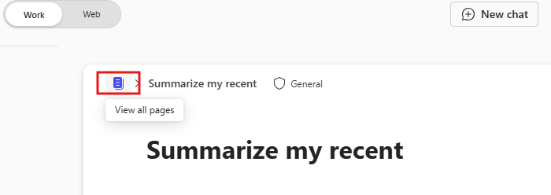

---
task:
    title: 'Immersion Experience - Business Manager'
---

## Immersion Experience - Business Manager  

Optimize daily tasks by reviewing communications, sending an email, and preparing for an upcoming meeting.  

You'll perform three tasks:  

- Review communications using **Microsoft 365 Copilot Chat**.  
- Prepare meeting talking points using **Copilot in Pages**.
- Draft a follow-up email using **Copilot in Outlook**.  

> **NOTE:** Sample prompts are provided to help you get started. Feel free to personalize them to suit your needs—be creative and explore! If Copilot doesn’t deliver the result you want, refine your prompt and try again. Enjoy the process and have fun experimenting!  

### Task 1: Review communications  

Using **Microsoft 365 Copilot Chat**, gather insights from recent interactions with a specific person about a particular topic or project. Focus on identifying key points, action items, and any outstanding questions. This ensures you stay up-to-date on team projects and can keep stakeholders informed of progress, challenges, and outcomes.  

**Steps**:

- Open a new browser tab and navigate to [M365copilot.com](https://m365copilot.com/).
- Ensure the "Work mode" tab is selected in Copilot Chat:

    

**Sample Prompt**:

```text
Summarize my recent interactions with [/Name of Person] regarding [specific topic or project]. Organize the summary by key points or actions discussed, and include any follow-up items or outstanding questions that may require attention.
```

> **NOTE:** Replace [Name of Person] with the person you’re focusing on, and [specific topic or project] with the relevant topic. Use the **/** character (slash) to reference internal contacts for quick access to recent interactions.

### Task 2: Prepare for a meeting  

Using **Copilot in Pages**, create talking points for an upcoming stakeholder meeting based on the insights gathered in Microsoft 365 Copilot Chat. Focus on progress updates, key dates, challenges or risks, and actionable next steps to ensure a productive discussion.

**Steps**:

1. Under **Copilot Chat's response** from the previous task, select **Edit in Pages**:  
   

2. In the new Pages screen that opens, select **View all Pages**:  
   

3. In the new Pages window, interact with Copilot by selecting the **Copilot Icon** on the right-hand side of the document.

**Sample Prompt**:

```text
Using these insights, draft talking points for an upcoming stakeholder meeting. Focus on progress updates, key dates, challenges and next steps. 
```

> **Tip:**  
> - Pages can be used as a collaborative space to work with your colleagues in real-time. Share the page by typing the "@" symbol followed by a colleague’s name.
> - After adding your colleague, click on their name to give them access. They will receive an email notification with a link to collaborate on the page.  

### Task 3: Send a follow-up email  

Using **Copilot in Outlook**, draft a follow-up email based on the insights gathered in Microsoft 365 Copilot Chat. Include details such as progress updates, pending actions, next steps, and a request for a follow-up meeting to discuss further.

**Steps**:

- In **Outlook**, select **New Email** and then  from the ribbon select **Copilot** > **Draft with Copilot**

    

**Sample Prompt**:

```text
Using the insights below, draft a follow-up email to [Name of Person] requesting an update on progress and next steps. Also, ask for a follow-up meeting to discuss further on the project deadline. 

[Paste insights from Copilot Chat here, or add your own insights]
```
