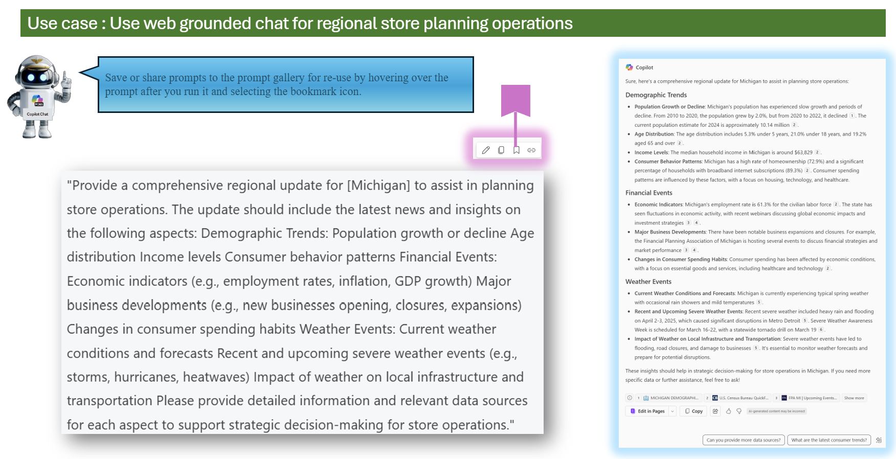
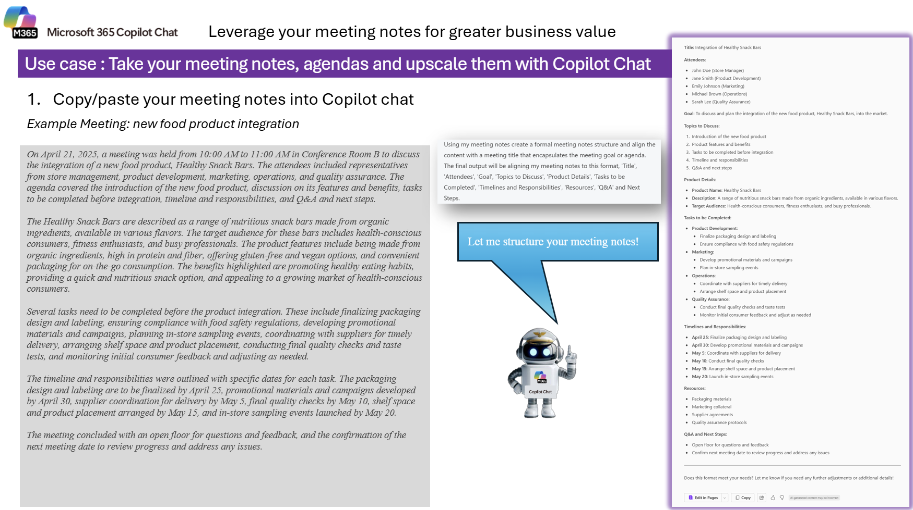
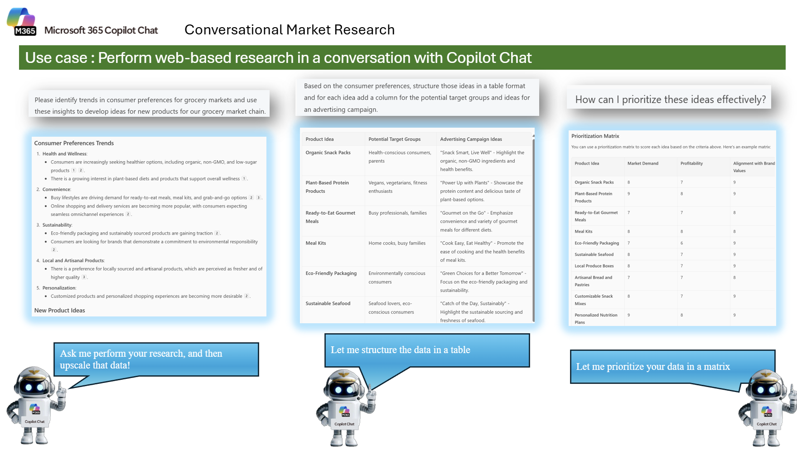

---
task:
    title: 'Copilot Chat'
---

## Copilot Chat  

Enhance decision-making by gathering insights, conducting online analysis, and drafting professional communications.  

You'll perform three tasks:  

- Research information using **Copilot Chat** (and optionally try GPT-5 for comparison).  
- Conduct an analysis using **Copilot Chat**.  
- Draft a professional communication using **Copilot in Word**.  

> **NOTE:** Sample prompts are provided to help you get started. Feel free to personalize them to suit your needs—be creative and explore! If Copilot Chat doesn’t deliver the result you want, refine your prompt and try again. Enjoy the process and have fun experimenting!  

---

### Task 1: Perform Online Research & Analysis  

Using **Copilot Chat**, gather insights on relevant topics by analyzing internal sources such as emails, chat history, and SharePoint documentation. Then, broaden your research with industry articles, external reports, or relevant websites.  

If you don't have a specific topic to research, focus on gathering insights from publicly available sources on a topic of your choice, such as **technology trends, market insights, customer experience, or compliance requirements.**  

**Steps**:

- Open a new browser tab and navigate to [M365copilot.com](https://m365copilot.com/)
- Select the Researcher agent or "@mention" the agent in chat
  
      

**Sample Prompt** *(if no internal topic is available)*:

```text
Provide a comprehensive regional update for [Michigan] to assist in planning store operations. 
The update should include the latest news and insights on the following aspects:

Demographic Trends:
- Population growth or decline
- Age distribution
- Income levels
- Consumer behavior patterns

Financial Events:
- Economic indicators (e.g., employment rates, inflation, GDP growth)
- Major business developments (e.g., new businesses opening, closures, expansions)
- Changes in consumer spending habits

Weather Events:
- Current weather conditions and forecasts
- Recent and upcoming severe weather events (e.g., storms, hurricanes, heatwaves)
- Impact of weather on local infrastructure and transportation

Please provide detailed information and relevant data sources for each aspect to support strategic decision-making for store operations.
```

> **TIP:**  If the first response is too broad or too shallow, refine your prompt by adding more context (e.g., specific region, industry, or time frame).

> **Learning Outcome:**
After completing this task, you'll be able to use Copilot Chat to perform structured online research and gather actionable insights.

---

### Task 2: Summarize & Structure Meeting Notes  

Using **Copilot Chat**, transform raw meeting notes into a structured, professional summary. This will help you clearly communicate key decisions, action items, and responsibilities, ensuring alignment across teams.  

If you don’t have internal meeting notes available, you can use a sample transcript or text file that contains general meeting content for practice.  

**Steps**:

- Open a new browser tab and navigate to [M365copilot.com](https://m365copilot.com/)
- Select Copilot Chat
- Upload your meeting notes transcript (text file)
  
      

**Sample Prompt** *(after uploading meeting notes)*:

```text
Using my meeting notes, create a formal meeting notes structure and align the content with a meeting title that encapsulates the meeting goal or agenda. 

The final output should format my notes with these sections:
- Title  
- Attendees  
- Goal  
- Topics to Discuss  
- Product Details  
- Tasks to be Completed  
- Timelines and Responsibilities  
- Resources  
- Q&A and Next Steps
```

> **NOTE:** You can ask Copilot to adjust the level of detail (e.g., “make the summary more concise” or “expand on tasks to be completed”).

> **Learning Outcome:**
After completing this task, you'll know how to turn unstructured notes into a professional, shareable meeting summary.

---

### Task 3: Refine Results with Follow-Up Questions  

Using **Copilot Chat**, practice enhancing your results by asking follow-up questions. This task shows how you can go beyond the first answer, structure the data, and get actionable insights for decision-making.  

**Steps**:

- Open a new browser tab and navigate to [M365copilot.com](https://m365copilot.com/)
- Select Copilot Chat
- Enter the following series of prompts to progressively refine your research results:
  
      

**Sample Prompt Sequence**:

```text
Please identify trends in consumer preferences for grocery markets and use these insights to develop ideas for new products for our grocery market chain.
```

```text
Please structure those ideas in a table format and for each idea add a column for the potential target groups and ideas for an advertising campaign.
```

```text
How can I prioritize these ideas effectively?
```

> **TIP:**  Follow-up questions help refine and upscale your results. Try clarifying prompts like: “Expand the table with additional product ideas based on recent market trends,” “Which ideas might have the highest ROI in the next 12 months?,” or “Create a prioritization matrix ranking these ideas by market demand, profitability, and alignment with brand values.”

> **Learning Outcome:**
After completing this task, you’ll understand how to use follow-up prompts to get richer insights and actionable recommendations from Copilot Chat.


### Task 4: Analyze Reviews & Visualize Sentiments  

Use **Copilot Chat** to transform raw survey or review data into actionable insights with charts and dashboards. You'll use a `.csv` file exported from Excel and ask Copilot to identify sentiment, uncover key themes, and generate visuals like a pie chart and word cloud.  

This task is perfect for analyzing customer feedback or product reviews and creating compelling visuals for presentations or reports.  

**Steps**:  

1. Save the following Excel notebook (right click "Save Link as").
- [Charger Reviews.csv](https://github.com/emontes07/Learning/blob/main/ResourceFiles/Charger%20Reviews.csv)
3. Save the selected worksheet as a `.csv` file.  
4. Open a new browser tab and navigate to [M365copilot.com](https://m365copilot.com/)  
5. Select Copilot Chat and upload your `.csv` file  
6. Use the following sample prompt to analyze and visualize the data.  

  

**Sample Prompt** *(after uploading your CSV file)*:

```text
For each review, analyze the whole sentence and provide a sentiment analysis.  
List the top 10 sentiments with counts based on reviews using the attached file. Analyze the column “Reviews” located in column C.

Then, list the sentiment with counts on reviews and the top 10 themes in the reviews.  
Create a pie graph with Easter-themed colors based on the sentiment count and then create a word cloud based on themes and mentions.
```


> **TIP:**  If you want to customize the visuals further, follow up with questions like: Can you provide a downloadable version of the word cloud? Can you generate a more vibrant color scheme for the pie chart? What software can I use to recreate these visuals manually?

> **Learning Outcome:** 
After completing this task, you’ll be able to analyze qualitative data from reviews or survey feedback, extract themes and sentiment, and create visual summaries with Copilot Chat.

