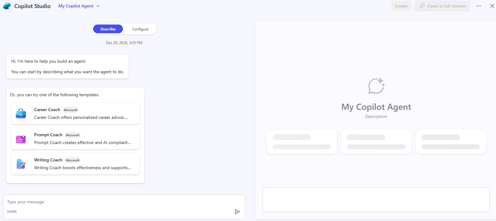
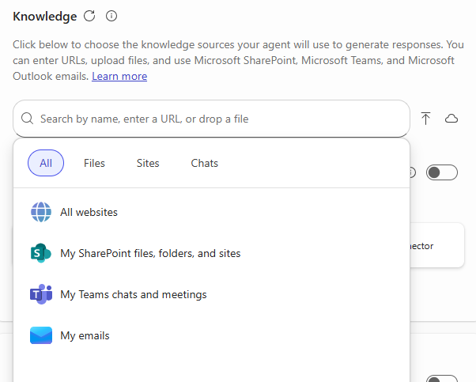

---
task:
    title: 'Immersion Experience – Agents (Business Users)'
---

## Immersion Experience – Agents (Business Users)

Discover how Microsoft 365 Copilot and Copilot Studio can help you solve everyday productivity challenges by designing a simple **retrieval-based agent**. This streamlined exercise will walk you through identifying a common issue, exploring how AI could help, and then creating a simple agent to test.  

You'll perform three tasks:

- Identify a productivity pain point  
- Explore how AI could help with retrieval and organization  
- Build and test a simple agent in **Copilot Studio**  

> **NOTE:** Sample prompts are provided to help you get started—feel free to personalize them to fit your situation.  
>
> If you’d like help generating or refining prompts, try the <a href="https://appsource.microsoft.com/en-us/product/office/WA200007578" target="_blank">Prompt Coach agent</a>, which can suggest, improve, and evaluate prompts so you get better results with Copilot.

### Task 1: Identify a Productivity Challenge  

Think about a common issue in your day-to-day work—something that slows you down or makes it harder to find or organize information. You can reflect individually, or use **Copilot Chat** as a partner to help generate ideas and surface common pain points.

Examples:

- Finding the latest version of a document  
- Gathering updates from multiple emails or chats  
- Remembering details from past projects or meetings  

**Steps:**  

- Open a new browser tab and navigate to [m365.cloud.microsoft/chat](https://m365.cloud.microsoft/chat). 

- Ensure the **Work mode** tab is selected in **Copilot Chat**.  

     

    **Sample Prompt:**

    ```text
    Summarize the top challenges I face in my daily work, based on recent emails, chats, and documents. Show results in a simple list with: 
    
    - Title (short label for the issue) 
    - Description (1–2 sentences) 
    ```  

### Task 2: Explore AI Solution Ideas with Researcher  

Use the **Researcher Agent** to explore how Copilot or agents might help with your chosen challenge.

**Steps:**  

- In the Copilot Chat menu, expand **Agents** and select **Researcher**.  

     

- Try a sample prompt like this:  

   ```text
   Explore possible AI solutions to help with [insert productivity issue]. Focus on retrieval-based approaches using Microsoft Copilot or Copilot Studio agents. Summarize two or three ways an agent could help me find, organize, or summarize information more efficiently.
   ```  

    > **TIP:** Keep the focus on practical, everyday use cases—like quickly surfacing a doc or pulling updates from multiple sources.
  
    > **NOTE:** Researcher may take 5–10 minutes to complete, depending on your request. Its responses are highly detailed, so while it’s working, try running the same prompt in Copilot Chat. Comparing the two outputs is a great way to see how each tool approaches the task.
    
### Task 3: Build and Test Your Agent  

Now, create a simple retrieval agent in **Copilot Studio** to address your challenge.  

**Steps:**  

1. In the **Copilot Chat** menu, select **Create agent**.

     

1. In the **Describe** tab, draft your agent’s role. For example:  

   ```text
   You’re a virtual assistant that helps me with [key task]. Be concise and always reference my recent files or resources when possible.
   ```  

     

1. Select the **Configure** Tab and add one knowledge source (e.g., **My Emails** or **My Teams chats and meetings**).

    

1. Test your agent using the **Test** pane and refine as needed.  
1. Select **Create** to publish your agent and start using it.  

> **TIP:** Even a very simple agent—like one that helps you find recent project files—can show the power of retrieval in your daily work.
