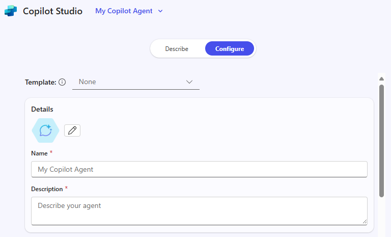
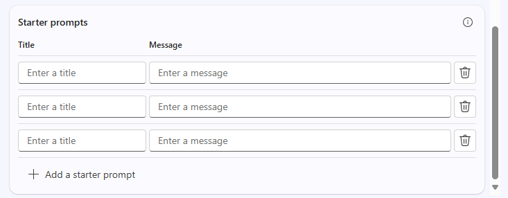

---
task:
    title: 'Immersion Experience – Agents (Executives)'
---

## Immersion Experience – Agents (Executives)

Explore how Microsoft 365 Copilot and Copilot Studio can help you address a real work-related challenge by designing a simple **retrieval-based agent**. This exercise will walk you through identifying an issue, breaking it down, exploring where AI might help, and then creating a conceptual agent to solve it.  

You'll perform four tasks:

- Identify a work-related issue  
- Break down the problem and explore where AI could help  
- Use **Researcher** to uncover insights and solution ideas  
- Conceptualize and mock up a retrieval-based agent in **Copilot Studio**  

> **NOTE:** Sample prompts are provided to help you get started—feel free to personalize them to fit your situation. 
>
> If you’d like help generating or refining prompts, try the <a href="https://appsource.microsoft.com/en-us/product/office/WA200007578" target="_blank">Prompt Coach agent</a><br>, which can suggest, improve, and evaluate prompts so you get better results with Copilot.

### Task 1: Identify a Work-Related Challenge  

Start by thinking about a real issue you encounter in your role—something that slows you down or makes information harder to access. You can reflect individually, or use **Copilot Chat** as a partner to help generate ideas and identify a challenge where retrieving and organizing knowledge would make a difference.  

To guide your thinking, consider:  

- **What’s working well today**  
- **What’s not working well**  
- **Where AI *might* be able to help**  

**Steps:**  

- Open a new browser tab and navigate to [m365.cloud.microsoft/chat](https://m365.cloud.microsoft/chat).  
- Ensure the **Work mode** tab is selected in **Copilot Chat**:  

     

    **Sample Prompt:**

   ```text
   I’m researching common day-to-day issues I face at work, such as processes, collaboration, or time management. Look at recent conversations from [Teams chats, Outlook emails, or other collaboration tools] related to [your role focus]. Summarize the key issues or pain points mentioned in the last 6 months. Show the results in a table with:  

    - Title: Short label for the issue  
    - Description: Brief summary of the challenge  
    - Frequency: How often it comes up (e.g., number of mentions)
   ```

### Task 2: Break Down the Problem

Using **Copilot Chat**, take the challenge you identified in Task 1 and break it into smaller parts:

- What makes this issue difficult?  
- Where does information get stuck or lost?  
- Who is impacted most?  

    **Sample Prompt (Copilot Chat – Work Mode):**

    ```text
    Break down the problem of [insert challenge]. Identify root causes, pain points, and which areas of work are most affected.
    ```

    > **TIP:** Think about where retrieval of knowledge would save you time or help your team make faster decisions.

### Task 3: Explore AI Solution Ideas with Researcher

Use the **Researcher Agent** to see how Copilot and agents could help. Focus on solutions that retrieve, organize, or summarize knowledge—not automate tasks. 

**Steps:**

- Open a new browser tab and navigate to [m365.cloud.microsoft/chat](https://m365.cloud.microsoft/chat).
- In the Copilot Chat menu, expand **Agents** and select **Researcher**  

      

    **Sample Prompt (Researcher Agent):**

    ```text
    Explore possible AI solutions to address [insert problem]. Focus on retrieval-based approaches using Microsoft Copilot, Copilot Studio agents, or connected knowledge sources. Summarize three possible solution approaches, their benefits, and limitations.
    ```

    > **TIP:** Look for opportunities where an agent could make knowledge easier to find, reuse, or share.

    > **NOTE:** Researcher may take 5–10 minutes to complete, depending on your request. Its responses are highly detailed, so while it’s working, try running the same prompt in Copilot Chat. Comparing the two outputs is a great way to see how each tool approaches the task.

### Task 4: Conceptualize Your Agent

Now, take your insights and create a simple mock agent in **Copilot Studio**. Keep the focus on retrieval—your agent should help surface, organize, or summarize information.

**Steps:**

- **Start in Copilot Studio**

    1. Open your browser and navigate to [m365.cloud.microsoft/chat](https://m365.cloud.microsoft/chat).
    1. Select **Create agent** in the right-hand rail to launch **Copilot Studio**.

        

- **Define your Agent (Describe tab or Configure tab)**

    1. Choose the **Describe** tab and use this sample prompt (or write your own):

        ```text
        You’re a virtual assistant for our [project/team name]. Your role is to help with [key tasks]. Be concise, stay on-brand, and reference our shared resources when possible.
        ```

        

        > **NOTE:** You can start from scratch or base your agent on a template, which pre-populates settings and instructions you can later customize.

    1. If **Describe** isn’t available, switch to the **Configure** tab and enter the same details manually: name, description, and agent instructions.

        

- **Customize your Agent**

    In the **Configure** tab, explore these options:

    1. Add at least one knowledge source (e.g., a document saved to OneDrive/SharePoint or Your emails).

        

    1. Define starter prompts to help others get started with your agent

        

        > **TIP:** Starter prompts help guide users on how to interact with your agent.

- **Test and Create**

    1. Use the **Test** feature (available in the right pane throughout the agent-building process) to try out your draft agent and refine any issues.
    2. Once satisfied, select **Create** to publish the agent.
    3. Share your agent with others or open it for immediate use.  

> **TIP:** The goal isn’t to build a perfect agent today—it’s to explore how retrieval-focused agents can make knowledge easier to access in your daily work.
