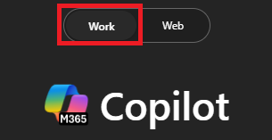

---
task:
    title: 'Immersion Experience - Legal'
---

## Immersion Experience - Legal  

Enhance legal decision-making by gathering insights, conducting legal analysis, and drafting professional communications.  

You'll perform three tasks:  

- Research legal information using **Copilot Chat**.  
- Conduct a legal analysis using **Copilot Chat**.  
- Draft a legal communication using **Copilot in Word**.  

> **NOTE:** Sample prompts are provided to help you get started. Feel free to personalize them to suit your needs—be creative and explore! If Copilot doesn’t deliver the result you want, refine your prompt and try again. Enjoy the process and have fun experimenting!  

### Task 1: Research Legal Information  

Using **Copilot Chat**, gather insights on relevant legal topics by analyzing internal sources such as emails, chat history, and SharePoint documentation. Then, broaden your research with industry articles, legal databases, external reports, or relevant case law.  

If you don't have an internal legal matter to research, focus on gathering insights from publicly available sources on a legal topic of your choice, such as **contract law, data privacy, employment law, or compliance requirements.**  

**Steps**:

- Open a new browser tab and navigate to [M365copilot.com](https://m365copilot.com/)  
- Ensure the "work mode" tab is selected in Copilot Chat:  

      

**Sample Prompt**:

```text
Summarize information from emails, chat messages, and SharePoint documentation related to [specific legal topic]. Then, enhance these insights by summarizing information from relevant legal articles, external reports, and other authoritative sources to provide a well-rounded perspective on [specific legal topic].
```

**Alternative Sample Prompt** *(if no internal legal topic is available)*:

```text
Research key considerations, compliance risks, and recent updates related to [select a legal topic, for example: data privacy laws]. Summarize information from authoritative sources such as government regulations, case law, and industry best practices. Highlight key challenges organizations face when addressing this issue.
```

> **NOTE:** Replace bracketed text ([ ]) with your chosen legal topic before submitting the prompt.

### Task 2: Conduct a Legal Analysis  

Using **Copilot Chat**, conduct a structured legal analysis that examines key provisions, implications, and potential risks. Identify common legal challenges and compare how similar organizations or industries approach these issues. Summarize the most critical takeaways to support legal decision-making.  

**Sample Prompt**:

```text
Analyze [specific legal topic] by summarizing its key provisions, potential risks, and business implications. Identify common legal challenges organizations face and compare how similar industries approach compliance and risk mitigation. Highlight key trends and assess potential impacts to provide a well-rounded understanding of its significance.
```

> **NOTE:** Replace bracketed text ([ ]) with your chosen legal topic before submitting the prompt.

> **TIP**  
>
> - Ask Copilot to export the response to a Word document to save for future use. Save the document to your OneDrive and copy the shared URL.  
> - To copy the link, open the saved Word document and select **Share** > **Copy Link**, as shown below:  
>   

### Task 3: Draft a Legal Communication  

Using **Copilot in Word**, draft a legal communication based on your research and analysis. This could be a legal memo, risk assessment, compliance guidance, client advisory, or an FAQ document.  

**Steps**:

- Launch Microsoft Word from your browser [word.new](https://word.new) or use the desktop application.  
- Enter your prompt where it says **"Describe what you'd like to write"**.  

      

**Sample Prompt**:

```text
Using the insights below, draft a legal advisory memo for internal stakeholders. Focus on explaining [specific legal topic], outlining potential risks, and providing recommendations for compliance or risk mitigation. [Paste insights from Copilot Chat here, or add your own insights]
```

> **NOTE:** Replace bracketed text ([ ]) with your chosen legal topic before submitting the prompt.

> **TIP:** When drafting your communication, use the shared document link from Task 2 to reference key insights. Alternatively, type **"/"** in Copilot to quickly reference and insert relevant files from OneDrive.
