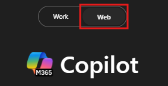

---
task:
    title: 'Immersion Experience - Operations'
---

## Immersion Experience - Operations

Draft a supplier transition plan by assessing potential vendors and outlining the transition process.

You'll perform three tasks:  

- Research supplier options using **Microsoft 365 Copilot Chat**.  
- Develop a supplier transition plan using **Copilot in Word**.  
- Communicate the supplier change using **Copilot in Outlook**.  

> **NOTE:** Sample prompts are provided to help you get started. Feel free to personalize them to suit your needs—be creative and explore! If Copilot doesn’t deliver the result you want, refine your prompt and try again. Enjoy the process and have fun experimenting!  

### Task 1: Research supplier options  

Using **Microsoft 365 Copilot Chat**, research and compare potential suppliers for a specific product or service. Identify key decision factors such as cost, reliability, service level agreements (SLAs), and scalability.  

**Steps**:

- Open a new browser tab and navigate to [M365copilot.com](https://m365copilot.com/).
- Ensure the "web mode" tab is selected in Copilot Chat:

    

**Sample Prompt**:

```text
Compare three leading suppliers for [product/service] in [select your industry]. Provide a summary of pricing, contract flexibility, service reliability, and customer support quality.
```

> **NOTE:** Replace [product/service] with the item or service you are evaluating for your supplier transition. Replace [select your industry] with the relevant industry, such as healthcare, manufacturing, or retail.  

> **TIP**  
>
> - Ask Copilot to export the response to a Word document to save for the next task. Save the document to your OneDrive and copy the shared URL.
> - To copy the link, open the saved Word document and select **Share** > **Copy Link**, as shown below:  
> 

### Task 2: Develop a supplier transition plan  

Using **Copilot in Word**, draft a structured plan outlining the supplier transition process, expected benefits, and key risks. Ensure the plan includes justifications for the switch, a transition timeline, and stakeholder considerations.  

- Launch Microsoft Word from your browser ([word.new](https://word.new)) or use the desktop application.
- Enter your prompt where it says **"Describe what you'd like to write"**.

    

**Sample Prompt**:

```text
Based on the supplier research from [Paste in shared Word document link from Task 1], draft a Supplier Transition Plan outlining why [Company] is switching to [Supplier X]. Include key benefits, a transition timeline, and potential risks.
```

> **NOTE:** Replace [Company] with your organization and [Supplier X] with the selected supplier. Adjust the details to fit the business need.

> **TIP** Ask Copilot in Word to summarize the transition plan into 3-4 key points for use in an email update.

### Task 3: Communicate the supplier change  

Using **Copilot in Outlook**, draft an email announcing the proposed supplier transition to your team. Clearly explain the reasoning, expected benefits, and any action steps needed for a smooth transition.  

**Steps**:

- In **Outlook**, select **New Email** and then  from the ribbon select **Copilot** > **Draft with Copilot**

    

**Sample Prompt**:

```text
Write an internal email to my team announcing a potential supplier transition to [Supplier X] using the key points below:

[Summarized key points from the Supplier Transition Plan]
```

> **NOTE:** Replace [Supplier X] with the chosen supplier and tailor the message for your internal audience.
