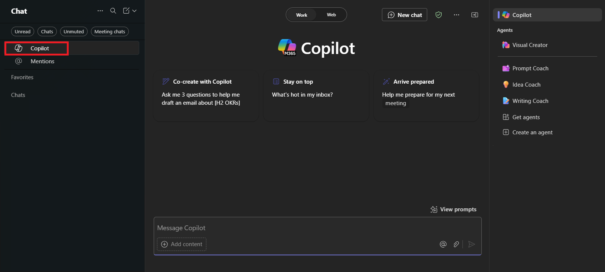

# Immersion Experience - Sales

Gather insights from recent customer interactions, align on key action items, and prepare for an upcoming customer meeting.

You will perform three tasks:
- Gather insights using **Microsoft 365 Copilot Chat**
- Align on action items using **Copilot in Outlook**
- Prepare for a customer meeting using **Copilot in Word**

## Task 1: Gather Insights

Using **Microsoft 365 Copilot Chat** (In teams), Gather and review insights from recent interactions with a customer on project implementation. These insights will help you understand customer concerns, progress, and any new opportunities to address during future engagements.

- In **Microsoft Teams**, select **Copilot** at the top of the **Chat** pane.  This will open a **Copilot** window.

    

**Sample Prompt**:

```text
Summarize my recent interactions with [/Name of Person] regarding [specific customer / topic / project]. Organize the summary by key points or actions discussed, and include any follow-up items or outstanding questions that may require attention.
```

> **NOTE:** Replace [Name of Person] with the person you’re focusing on, and [specific customer / topic / project] with the relevant topic. Use the **/** character (slash) to reference internal contacts for quick access to recent interactions.

## Task 2: Align on Action Items

Using **Copilot in Outlook**, draft a follow-up email based on the insights gathered from Teams Chat. Include open action items, clarify responsibilities, and provide updates to a colleague or team to ensure alignment and accountability.

- In **Outlook**, select **New Email** and then  from the ribbon select **Copilot** > **Draft with Copilot**

    

**Sample Prompt**:

```text
Using the insights below, draft a follow-up email to [Name of Person] highlighting the key actions and next steps. Also, ask for a follow-up meeting to discuss further.

[Paste insights from Copilot Chat here]
```

## Task 3: Prepare for a Customer Meeting

Using **Copilot in Word**, draft talking points for an upcoming customer status update meeting. Ensure the talking points focus on key deliverables, address customer priorities, and provide clarity on next steps

- Launch Microsoft Word from your browser (<a href="https://word.new" target="_blank">word.new</a>) or use the desktop application.
- Enter your prompt where it says **"Describe what you'd like to write"**.

    

**Sample Prompt**:

```text
Using the insights below, draft talking points for an upcoming status update meeting with [Customer Name]. Focus on any challenges and next steps.

[Paste insights from Copilot Chat here, or add your own insights]
```
